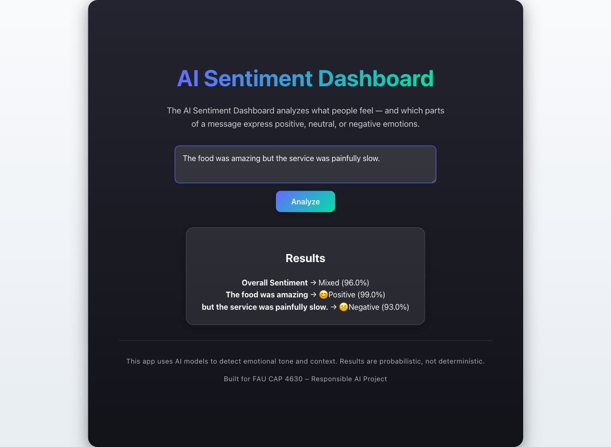
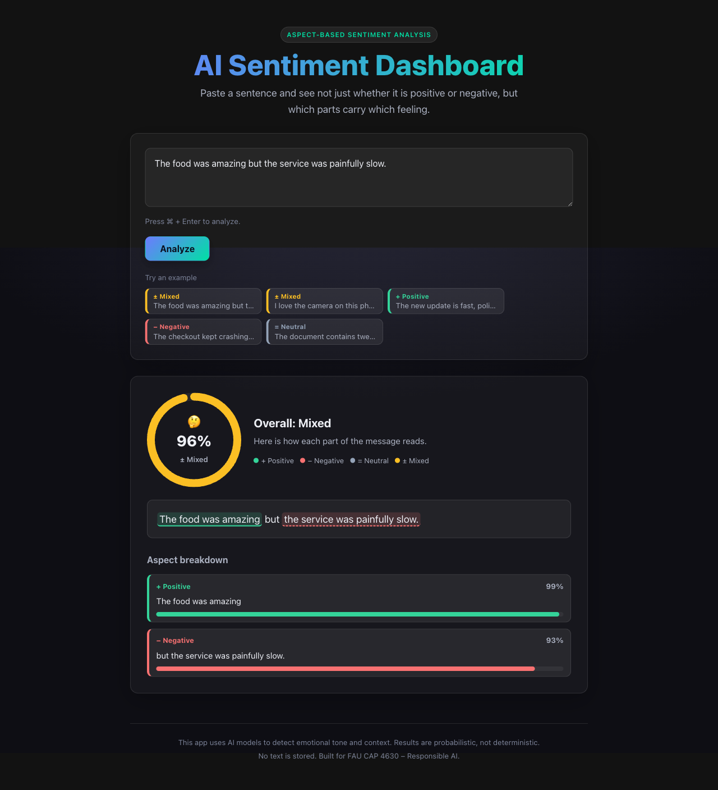
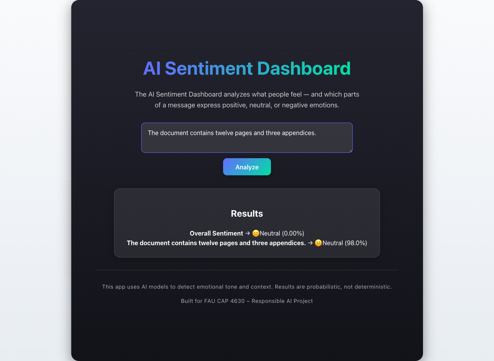
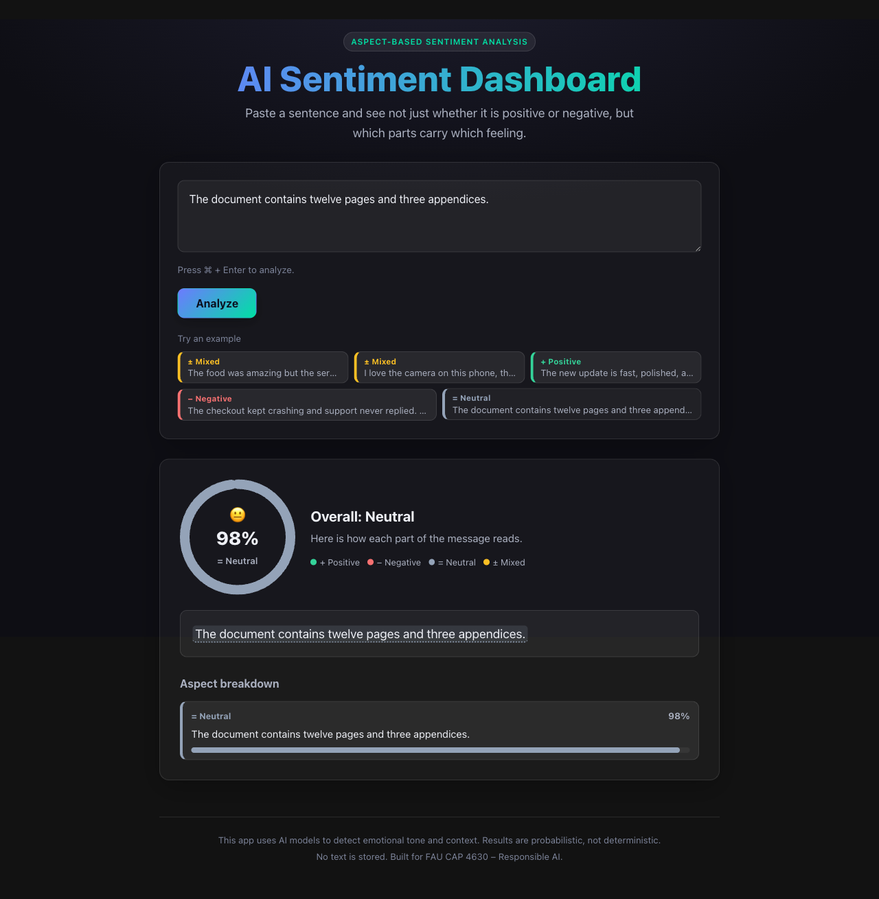

<!--
  DEV.to submission draft for the GitHub Finish-Up-A-Thon.
  Fill in the bracketed placeholders, upload the images from docs/screenshots/
  into the DEV editor, then paste this in. Tags suggestion: #githubchallenge #ai #react #python
  Title suggestion: "Finishing the sentiment dashboard I left at 'it works on my machine'"
-->

## What I built

The AI Sentiment Dashboard reads a sentence and shows the feeling behind each part of it, not a single label stamped on the whole thing. You type a message, hit Analyze, and it breaks the sentence into aspects, scores each one, and highlights the exact words that carried the sentiment. A line like "the food was amazing but the service was painfully slow" comes back as Mixed, with the praise in green and the complaint in red.

**Live demo:** https://ai-sentiment-dashboard.netlify.app
**Code:** https://github.com/MatthewOscar/AI-Sentiment-Dashboard-

> The API runs on a free Hugging Face Space that sleeps after 48h idle, so the first load may take ~30 to 60 seconds to wake the model. The app shows a "waking up" state while it does, then it is instant.

[Optional: drop a short screen recording or GIF here. A 10 second clip of clicking a Mixed example and watching the two clauses light up is the best thing you can show.]

## Why this one mattered to me

We started this as a team project for FAU's CAP 4630 (Artificial Intelligence) course. The model work was genuinely interesting, since aspect-based sentiment is a real step up from the usual positive-or-negative demo, but the project stalled the way course projects do once the grade is in. It ran on localhost, the UI printed results as a plain wall of text, and the README described a model we were not even using anymore. It was the classic "works on my machine, then never touched again" repo. I wanted to actually finish it.

## The comeback story

Here is the honest before. The whole result was a list of lines of text:

The repo even had a "Future Improvements" list that called out the two things we never did: add a word-level explainability view, and deploy it so other people could use it. So I made that list the plan and checked off both boxes.

After:

What changed:

- **In-text highlighting.** The original sentence is re-rendered with each aspect highlighted by sentiment, so you can see which words drove the score. Hovering a bar lights up its phrase in the text, and hovering a phrase lights up its bar.
- **A real dashboard.** An animated confidence gauge for the overall read, and a per-aspect probability breakdown shown as donuts on desktop and stacked bars on mobile, laid out in a side rail next to the highlighted text. The visuals are hand-built SVG animated with Motion, so the bundle stays small and the styling matches the theme exactly.
- **It is actually deployed.** The React app runs on Netlify and the FastAPI model API runs on a Hugging Face Docker Space, wired together with an environment variable.
- **Honest internals.** The backend was loading a heavy spaCy transformer pipeline that was only being used to split sentences, so I swapped it for the small model and cut the cold-start time and memory hard. I also fixed a bug where a neutral result always reported 0% confidence, and added a real loading, empty, and error state with retry.
- **Accessibility and themes.** Every sentiment shows a word and a shape glyph as well as a color, so it does not rely on hue alone. There is keyboard submit, ARIA labelling, a responsive mobile layout, and light and dark themes that follow the system setting with a manual toggle.
- **Then I kept going past the original list.** A cached local history you can reopen instantly (it never re-calls the model), shareable links that carry the analyzed text in the URL so a link opens straight to its result, and a backend status indicator with graceful cold-start handling for the free hosting.

Neutral confidence, before and after, is a small example of the kind of thing that had been quietly wrong:

| Before | After |
| --- | --- |
|  |  |

## How AI assistance fit in

<!--
  HONEST NOTE: the challenge template asks specifically about GitHub Copilot's role.
  Describe what you actually used. If you used Copilot in the editor, say where
  (autocomplete, inline edits, chat). If you used another AI coding tool, name it.
  Do not claim Copilot did work it did not do; judges read these and authenticity reads well.
  A candid line about the recent move to usage-based Copilot pricing is fair game if it is true for you.
-->

I leaned on AI coding assistance heavily for the rebuild, and it was most useful for the unglamorous parts: writing the aspect-to-text matching that maps each model result back onto the original sentence (including the annoying case where a clause comes back with a leading "but"), generating the SVG gauge math, and getting the Dockerfile right so the model weights bake into the image at build time instead of downloading on the first request. I still made the calls that mattered: dropping the heavy spaCy model, choosing hand-built SVG plus Motion over a chart library, and shaping the before-and-after story. The assistant was fast hands; the direction was mine.

## Responsible AI

The tool stores nothing. Each request is processed once and discarded. Every result shows a confidence value and the breakdown of which words led to it, and the footer is clear that the output is probabilistic and meant for learning, not advice. The model reflects its training data, so it can miss sarcasm and handle slang or dialects unevenly, and I say so plainly in the UI.

## Tech

React 19 and Vite on the frontend, with hand-built SVG visuals animated with Motion. FastAPI on the backend, using spaCy for clause splitting and a DeBERTa ABSA model for the sentiment scoring. Deployed on Netlify and a Hugging Face Docker Space.

## Team

- Machine Learning Lead: Christopher Piedra [@username]
- Backend Developer: Matthew White [@username]
- Frontend Developer: Matthew Wyatt [@username]
- Data Engineer: Sophia Camacho [@username]
- Responsible AI and Documentation Lead / PM: Mackenzie Falla [@username]

Thanks for reading. If you try the demo, the Mixed examples are the ones to start with.
